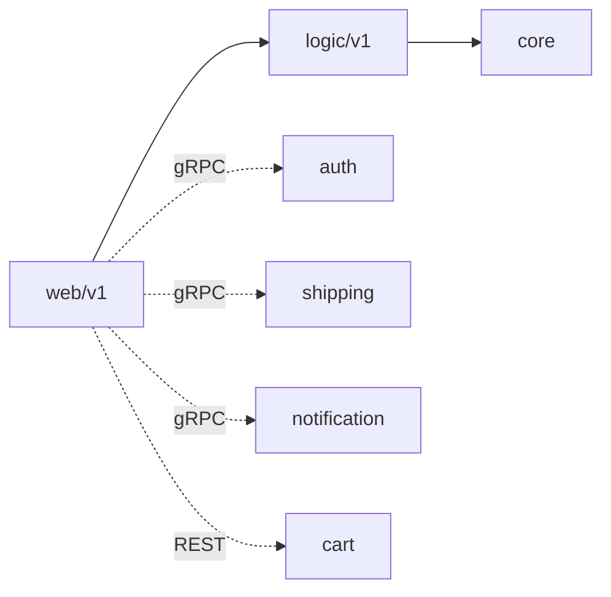

# Contributing to order-service

This document offers guidance for contributors and AI agents working in this
repository. It is the source of truth for agent instructions; keep it updated
when conventions change.

## Contribution workflow

- Never commit or push directly to `main`. Branch first, then open a PR.
- Branch names use a conventional prefix: `feat/`, `fix/`, `docs/`, `refactor/`,
  `chore/`, `test/`.
- Commit subjects are imperative mood, capitalised, no trailing period, and
  ≤ 50 characters (`Add idempotency replay guard`, not `Added` / `Adds`).
- Add a body (wrapped at 72 columns) only when the change needs the *what* and
  *why* explained; separate it from the subject with one blank line.
- Do not add attribution trailers (`Signed-off-by`, `Co-authored-by`,
  `Generated-by`, etc.), GitHub issue references (`Fixes #123`), or `@`-mentions.
  Put issue links in the PR description instead.
- One logical change per PR. PRs are squash-merged, so keep the final subject
  PR-worthy.

## Code quality

All code changes MUST build, vet, test, and lint clean before review. CI's
`go-check` job enforces this on every PR; PRs with lint errors are not merged.

- Keep the strict three-layer boundaries (see Conventions). Layer violations are
  rejected in review.
- Use constructor injection for dependencies; do not introduce package-level
  global clients.
- Check every error return (`errcheck`); use `errors.New` when there is no format
  verb (`perfsprint`); use `net.JoinHostPort` over `fmt.Sprintf` for host:port
  (`nosprintfhostport`); use `http.NewRequestWithContext` (`noctx`).
- Extract repeated string literals to constants (`goconst`) and split high-
  complexity functions into helpers (`gocognit`).
- The linter is `golangci-lint` v2 with `.golangci.yml` (80+ linters enabled).
- Before pushing or opening a PR, verify Sonar new-code coverage ≥80%: run
  `go test -race -coverprofile=coverage.out ./...` and confirm changed lines are
  covered, including BOTH branches of any new conditional. `**/cmd/**`,
  `**/db/migrations/**`, `**/core/repository/**` are coverage-excluded; everything
  else counts.

## Project overview

Order processing microservice. It owns order creation, listing, retrieval, and
the aggregated order-details view (order + shipment). It is a gRPC **client** to
auth, shipping, and notification, and a REST client to cart. It is never called
by other services over its Logic layer — cross-service entry is HTTP only.

- Module: `github.com/duynhlab/order-service`
- Runtime: Go 1.26, Gin HTTP framework
- Database: PostgreSQL 18 via `pgx/v5` (cluster `transaction-db`, CloudNativePG,
  shared with cart-service; database `order`; PgCat pooler routes reads to
  replicas, writes to primary; synchronous replication)
- Shared libraries: `github.com/duynhlab/pkg` (`grpcx`, `authmw`, `obsx`,
  `proto/*`)
- Observability: OpenTelemetry tracing, Prometheus metrics, Pyroscope profiling

### HTTP API

All routes are private (JWT enforced at the `/order/v1/private` group via
`authmw.Middleware`).

| Method | Path | Description |
|--------|------|-------------|
| `GET` | `/order/v1/private/orders` | List the caller's orders |
| `GET` | `/order/v1/private/orders/:id` | Get one order |
| `GET` | `/order/v1/private/orders/:id/details` | Aggregated order + shipment |
| `POST` | `/order/v1/private/orders` | Create an order from the caller's cart |

Full URL convention and route inventory:
[`homelab/docs/api/api-naming-convention.md`](https://github.com/duynhlab/homelab/blob/main/docs/api/api-naming-convention.md).

## Repository layout

```
order-service/
├── cmd/main.go                 # Composition root: config, clients, server, shutdown
├── config/config.go            # Env-driven config + Validate()
├── db/migrations/
│   └── sql/                    # golang-migrate migrations (`000001_*.up.sql`), embedded via `embed.go`
├── internal/
│   ├── core/                   # Domain models, repositories, DB connection
│   │   ├── database.go
│   │   ├── domain/             # Models, repository interfaces, domain errors
│   │   └── repository/         # Postgres repository + transaction manager
│   ├── logic/v1/               # Business rules (no SQL, no HTTP)
│   └── web/v1/                 # HTTP handlers, validation, aggregation, clients
│       ├── handler.go          # OrderHandler + order CRUD
│       ├── aggregation.go      # /orders/:id/details + shipmentFetcher
│       ├── cart_client.go      # REST client to cart
│       ├── shipping_grpc_client.go
│       ├── notification_client.go
│       └── validation.go
├── middleware/                 # tracing, logging, prometheus, profiling, resource
└── Dockerfile
```

## Build, test, lint

Run from the repository root. `GOTOOLCHAIN=auto` lets the pinned Go toolchain
download itself if missing.

```bash
GOTOOLCHAIN=auto go build ./...
GOTOOLCHAIN=auto go vet ./...
GOTOOLCHAIN=auto go test ./...
golangci-lint run --timeout=10m
```

### Testing conventions

- **Unit tests** — stdlib `testing` only (no testify/gomock), hand-written mocks for
  interfaces, table-driven subtests, in `*_test.go` next to the code: Web (`httptest`),
  Logic (pure — mock the repo), the `internal/saga` orchestrator, `middleware`, `config`.
  Run with `go test ./...` (no Docker).
- **Integration tests** — `internal/core/repository` is tested against a **real Postgres**
  via testcontainers, build-tagged `//go:build integration` (the default `go build`/`go test`
  skip them, so the binary never links testcontainers). Run locally with Docker:
  `go test -tags=integration ./internal/core/repository/...`. CI wires `integration: true`
  (go-check) + `integration-coverage: true` (sonar), and merges both coverage profiles into
  the ≥ 80% new-code gate.
- **Before pushing**, both the unit run *and* the integration suite must be green locally —
  green unit ≠ green CI (CI also runs integration with Docker).

## Conventions

### Three-layer architecture

Dependencies flow one way: `Web → Logic → Core`. Never the reverse.

| Layer | Location | Allowed | Forbidden |
|-------|----------|---------|-----------|
| Web | `internal/web/v1/` | HTTP handling, JSON binding, DTO mapping, aggregation, calling Logic, service clients | SQL, direct DB access, business rules |
| Logic | `internal/logic/v1/` | Business rules, calling repository interfaces, domain errors | SQL, `database.GetPool()`, `gin`, HTTP, `*gin.Context` |
| Core | `internal/core/` | Domain models, repository implementations, SQL, DB connection | HTTP handling, business orchestration |

- Web imports Logic and `core/domain`; Logic imports `core/domain` and its
  repository interfaces; Core imports nothing from Web or Logic.
- Use repository interfaces (defined in `core/domain/`) for data access in Logic.
- Cross-service calls go through Web-layer clients, never by importing another
  service's Logic.

### East-west clients

Clients are constructed in `cmd/main.go` and **constructor-injected** into
`OrderHandler` via `NewOrderHandler(orderService, cartClient, notificationClient,
shippingClient)`. They are struct fields, not package globals. Match this
injection pattern when adding a client.

| Dependency | Transport | Method / Endpoint | Env var | When |
|------------|-----------|-------------------|---------|------|
| shipping | gRPC | `shipping.v1.ShippingService/GetShipmentByOrder` | `SHIPPING_GRPC_ADDR` | order-details aggregation |
| notification | gRPC | `notification.v1.NotificationService/SendEmail` | `NOTIFICATION_GRPC_ADDR` | best-effort on checkout |
| cart | REST | `GET` / `DELETE /cart/v1/private/cart` | `CART_SERVICE_URL` | read items on create, clear after |

- The shipping and notification gRPC clients dial at startup; a dial failure
  aborts startup (treated as misconfiguration). JWT validation on private
  routes is local-only via shared `authmw` (cached JWKS) — no auth gRPC call.
- Cart REST calls forward the caller's `Authorization` header so cart can
  validate the JWT.
- The cart is the authoritative source for order items and pricing — client-
  supplied prices are ignored on create.

### Observability

- Middleware chain (in `setupServer`): tracing → logging → metrics.
- Tracing: OpenTelemetry via `middleware.TracingMiddleware`.
- Logging: Zap. `middleware.LoggingMiddleware` derives the log `trace_id` from
  the active span with `obsx.TraceIDFromContext` (falls back to header or a
  generated id).
- Metrics: a single `/metrics` endpoint serves both HTTP RED metrics
  (`middleware.PrometheusMiddleware`) and gRPC client RED metrics
  (`rpc_client_*`). `obsx.SetupMetrics()` bridges the otelgrpc metrics onto the
  shared Prometheus registry and MUST run before any `grpcx.Dial` (so the global
  MeterProvider is installed when the otelgrpc stats handlers start). It runs
  only when `METRICS_ENABLED=true`. The platform ServiceMonitor scrapes
  `/metrics`; there is no separate metrics port.
- Profiling: Pyroscope, enabled by `PROFILING_ENABLED`.

### Diagrams

Use Mermaid for all diagrams. Do not use ASCII-art diagrams.



## Gotchas

- **Best-effort notification and cart clear are non-fatal.** After an order
  commits, `publishOrderCreated` (gRPC) and `clearCartBestEffort` (REST DELETE)
  run on a context detached from the request (`context.WithoutCancel`, 3s
  timeout). Failures are logged and ignored — the order is already persisted.
  Never let either path return an error that fails order creation.
- **Idempotency replay runs before the cart read.** `Idempotency-Key` is checked
  in `handleIdempotentReplay` first, because a retry arrives after the first
  successful order already cleared the cart.
- **Missing shipment is non-fatal.** In `/orders/:id/details`, a shipment lookup
  error or an absent shipment is logged and the response simply omits the
  `shipment` field. The gRPC client returns `(nil, nil)` when the order has no
  shipment, matching the REST contract's HTTP-404 handling.
- **Kyverno image rules.** Container images are `ghcr.io/duynhlab/<service>:<sha>`
  or `:vX.Y.Z` — never `:latest`. Manifests need resource requests/limits and
  liveness/readiness probes; admission will reject otherwise.
- **golang-migrate migrations.** Migrations are embedded via `embed.FS`
  (`db/migrations/embed.go`) and applied through `pkg/migratex` from the app's
  `migrate` subcommand; the init container reuses the app image
  (`args: ["migrate"]`). Migrations are forward-only.
